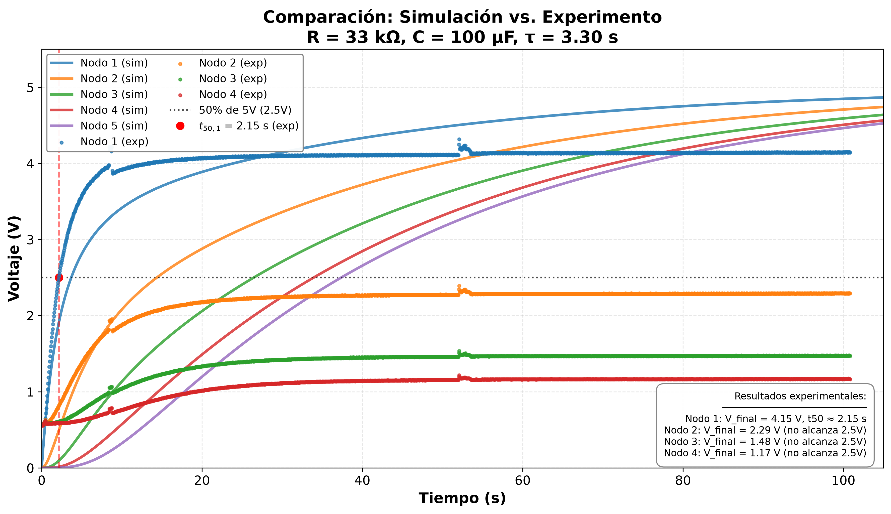

# Simulación analógica de la ecuación de difusión mediante redes RC

## Un enfoque experimental para la enseñanza de la física


---

## Resumen

La ecuación de difusión es fundamental en múltiples áreas de la física e ingeniería. En este trabajo presentamos el desarrollo teórico y la validación experimental de un computador analógico basado en una red de resistencias y capacitores (RC) que resuelve la ecuación de difusión en tiempo real. Se establece la analogía formal entre el sistema térmico y el circuito eléctrico, derivando la equivalencia matemática entre la difusividad térmica α, el espaciado de la malla h y la constante de tiempo del circuito RC:

$$\alpha = \frac{h^{2}}{RC}$$

Se implementó un prototipo de 5 nodos (configuración 1×5) con parámetros $R = 33\,\text{k}\Omega$ y $C = 100\,\mu\text{F}$, y se diseñó un sistema de adquisición de datos de bajo costo utilizando un **Arduino Uno**, el cual permitió registrar la evolución temporal de los voltajes en los nodos a través de sus entradas analógicas A0-A3. Los resultados experimentales se comparan con la simulación numérica, mostrando una concordancia cualitativa que confirma la analogía térmico-eléctrica. Este enfoque demuestra el potencial de las herramientas de hardware abierto para la instrumentación científica en la enseñanza de la física.

**Palabras clave:** computación analógica, ecuación de difusión, redes RC, analogía térmico-eléctrica, simulación numérica, Arduino, enseñanza de la física

---

## Contenido del repositorio

| Archivo | Descripción |
|---------|-------------|
| `simulacion_rc_1x5.py` | Script principal de la simulación numérica (RK4) |
| `datos_RC_individual.xlsx` | Datos experimentales (mediciones reales) |
| `comparacion_teoria_experimento.png` | Figura comparativa: simulación vs. experimento |
| `arduino_adquisicion/adquisicion_arduino.ino` | Código para Arduino Uno |
| `arduino_adquisicion/adquisicion_python.py` | Script Python para adquirir y guardar datos |
| `README.md` | Este archivo |

---

## Marco teórico: la analogía térmico-eléctrica

La conducción de calor en un medio isotrópico está gobernada por la ecuación de calor:

$$\frac{\partial T(x,t)}{\partial t} = \alpha \frac{\partial^{2}T(x,t)}{\partial x^{2}}$$

donde $T(x,t)$ es la temperatura y $\alpha = k/(\rho c_p)$ es la difusividad térmica.

Aplicando la ley de corrientes de Kirchhoff (LCK) al nodo $i$ de una red RC 1D:

$$\frac{dV_{i}}{dt} = \frac{1}{RC}\left(V_{i-1} - 2V_{i} + V_{i+1}\right)$$

Comparando con la discretización por diferencias finitas de la ecuación de calor, se establece la equivalencia fundamental:

$$\boxed{\alpha = \frac{h^{2}}{RC}}$$

donde $h$ es el espaciado de la malla espacial. La cantidad $1/(RC)$ tiene unidades de $s^{-1}$ y representa una tasa temporal efectiva de decaimiento del sistema.

---

## Parámetros de la simulación y el experimento

| Parámetro | Símbolo | Valor |
|:----------|:--------|:------|
| Resistencia entre nodos | $R$ |$33\,\text{k}\Omega$ |
| Capacitancia a tierra | $C$ | $100\,\mu\text{F}$ |
| Constante de tiempo | $\tau = RC$ | $3.30\,\text{s}$ |
| Voltaje de excitación | $V_0$ | $5\,\text{V}$ |
| Resistencia de alta impedancia | $R_{\text{hi}}$ | $100\,\text{k}\Omega$ |
| Paso de integración | $\Delta t$ | $0.05\,\text{s}$ |
| Tiempo total de simulación | $t_{\text{final}}$ | $60.0\,\text{s}$ |
| Número de nodos | $N$ | 5 |
| Espaciado de malla | $h$ | $1.0\,\text{cm}$ |
| Difusividad equivalente | $\alpha = h^2/(RC)$ | $3.03 \times 10^{-5}\,\text{m}^2/\text{s}$ |

**Condiciones de frontera implementadas:**
- **Extremo izquierdo (Nodo 1):** Dirichlet (voltaje fijo $V_0 = 5.0\,\text{V}$)
- **Extremo derecho (Nodo 5):** Neumann (corriente nula, circuito abierto — equivalente a aislamiento térmico)

**Medición experimental:** Se midieron los nodos 1 a 4. El nodo 5 fue modelado en la simulación pero no se midió físicamente.

---
## Adquisición de datos experimentales

Los datos experimentales fueron capturados utilizando un **Arduino Uno** como sistema de adquisición de bajo costo. Los voltajes en los nodos 1 a 4 de la red RC se conectaron directamente a las entradas analógicas **A0, A1, A2 y A3** del Arduino.

### Hardware utilizado
- Arduino Uno
- Red RC 1×4 con $R = 33\,\text{k}\Omega$, $C = 100\,\mu\text{F}$
- Fuente de alimentación de $5\,\text{V}$

### Código de adquisición

El código para el Arduino se encuentra en `arduino_adquisicion/adquisicion_arduino.ino`. Para usarlo:

1. Conecta los nodos de la red RC a los pines A0-A3 del Arduino.
2. Carga el código en el Arduino.
3. Ejecuta el script de Python `arduino_adquisicion/adquisicion_python.py` para leer los datos y guardarlos en un archivo CSV.

### Archivo de datos

Los datos capturados se encuentran en el archivo `datos_RC_individual.xlsx` (formato Excel). Las columnas del archivo son:

| Columna | Descripción |
|---------|-------------|
| Tiempo (ms) | Tiempo en milisegundos |
| Canal_1 (V) | Voltaje en el Nodo 1 |
| Canal_2 (V) | Voltaje en el Nodo 2 |
| Canal_3 (V) | Voltaje en el Nodo 3 |
| Canal_4 (V) | Voltaje en el Nodo 4 |

---

## 📊 Resultados principales

### Tiempos de subida al 50 % ($t_{50}$) — Simulación

| Nodo | $t_{50}$ (s) | Observación |
|:----:|:--------:|:------------|
| 1 | 3.70 | Alcanza el 50 % ($\approx 1.1\tau$) |
| 2 | 14.40 | Alcanza el 50 % ($\approx 4.4\tau$) |
| 3 | 26.50 | Alcanza el 50 % ($\approx 8.0\tau$) |
| 4 | 33.95 | Alcanza el 50 % ($\approx 10.3\tau$) |
| 5 | 37.40 | Alcanza el 50 % ($\approx 11.3\tau$) |

### Comparación con el experimento (Nodos 1–4)

| Nodo | $t_{50}$ (simulado, s) | $t_{50}$ (medido, s) | Diferencia |
|:----:|:---:|:---:|:---:|
| 1 | 3.70 | 5.5 | 1.8 s |
| 2 | 14.40 | 26 | 11.6 s |
| 3 | 26.50 | 42 | 15.5 s |
| 4 | 33.95 | — | — |

**Nota:** Los tiempos experimentales son estimados visualmente a partir de las curvas de medición. El Nodo 4 no alcanzó el 50 % ($2.5\,\text{V}$) durante el tiempo de medición de 60 s.

### Verificación de la equivalencia fundamental

Con $h = 1.0\,\text{cm} = 0.010\,\text{m}$ y $\tau = RC = 3.30\,\text{s}$:

$$\alpha = \frac{(0.010 \text{m})^{2}}{3.30 \text{s}} = 3.03 \times 10^{-5} \text{m}^{2}/\text{s}$$

### Comparación gráfica

La siguiente figura muestra la superposición de la simulación (líneas) y los datos experimentales (puntos) para los nodos 1 a 4:



**Análisis de la discrepancia:** Los tiempos experimentales son mayores que los simulados. Esto puede deberse a:
- La resistencia de alta impedancia ($100\,\text{k}\Omega$) actúa como divisor de voltaje.
- Tolerancias de componentes ($\pm 5\,\%$ o $\pm 10\,\%$).
- Corriente de fuga en capacitores electrolíticos.
- Impedancia de entrada del osciloscopio (1 MΩ).

A pesar de las diferencias cuantitativas, el comportamiento cualitativo es el mismo: la perturbación se propaga desde el nodo excitado hacia los vecinos con un retardo que aumenta con la distancia.

---

## Requisitos

- Python 3.10+
- NumPy
- Matplotlib
- Pandas
- openpyxl (para leer archivos .xlsx)
- pyserial (para comunicación con Arduino)

## Cómo ejecutar

### En local (con Python)

```bash
# Clonar el repositorio
git clone https://github.com/TheMelladator/simulacion-red-rc-1x5.git
cd simulacion-red-rc-1x5

# Instalar dependencias
pip install numpy matplotlib pandas openpyxl pyserial

# Ejecutar la simulación
python simulacion_rc_1x5.py

# Para adquirir datos con Arduino
cd arduino_adquisicion
python adquisicion_python.py
```

### Adquisición de datos con Arduino

1. Conectar la red RC al Arduino:
   - Nodo 1 → A0
   - Nodo 2 → A1
   - Nodo 3 → A2
   - Nodo 4 → A3
   - Tierra del circuito → GND del Arduino

2. Cargar el código en el Arduino:
   - Abrir `arduino_adquisicion/adquisicion_arduino.ino` en el IDE de Arduino
   - Seleccionar la placa "Arduino Uno" y el puerto correcto
   - Subir el código

3. Configurar el puerto en el script de Python:
   - Cambiar la variable `PUERTO` en `adquisicion_python.py`
   - Windows: `'COM3'`, `'COM4'`, etc.
   - Linux/Mac: `'/dev/ttyUSB0'`, `'/dev/ttyACM0'`, etc.

4. Ejecutar el script de Python:
   ```bash
   cd arduino_adquisicion
   python adquisicion_python.py
   ```

5. Los datos se guardarán automáticamente en un archivo CSV con formato `datos_experimentales_YYYYMMDD_HHMMSS.csv`.

---

## 👤 Autor

**Fernando Mellado C.**  
Escuela Superior de Física y Matemáticas  
Instituto Politécnico Nacional  
Av. Instituto Politécnico Nacional S/N, Edif. 9, Col. Nueva Industrial Vallejo, Gustavo A. Madero, C.P. 07700, Ciudad de México.  
Correo: luisfernandomelladocanas@outlook.com

## Cómo citar

Si utilizas este código o estos datos, por favor cita:

> Mellado C., F. *Simulación Analógica de la Ecuación de Difusión mediante Redes RC: Un Enfoque Experimental para la Enseñanza de la Física Computacional*. Escuela Superior de Física y Matemáticas, Instituto Politécnico Nacional, Ciudad de México.

---

## Referencias

[1] V. Bush, "The Differential Analyzer: A New Machine for Solving Differential Equations," *Journal of the Franklin Institute*, vol. 212, no. 4, pp. 447–488, 1931, doi: 10.1016/S0016-0032(31)90616-9.

[2] H. S. Carslaw and J. C. Jaeger, *Conduction of Heat in Solids*, 2nd ed. Oxford: Clarendon Press, 1959.

[3] J. Crank, *The Mathematics of Diffusion*, 2nd ed. Oxford: Clarendon Press, 1975.

[4] J.-B.-J. Fourier, *Théorie analytique de la chaleur*. Paris: Chez Firmin Didot, père et fils, 1822.

[5] G. A. Korn and T. M. Korn, *Electronic Analog Computers (d-c Analog Computers)*, 2nd ed. New York: McGraw-Hill, 1956.

[6] J. D. Murray, *Mathematical Biology: I. An Introduction*, 3rd ed. New York: Springer, 2002, doi: 10.1007/B98868.

[7] G. S. Ohm, *Die galvanische Kette, mathematisch bearbeitet*. Berlin: T. H. Riemann, 1827.

[8] A. Okubo, *Diffusion and Ecological Problems: Mathematical Models*. Berlin: Springer-Verlag, 1980.

[9] A. D. Polyanin, *Handbook of Linear Partial Differential Equations for Engineers and Scientists*. Boca Raton, FL: Chapman & Hall/CRC, 2002, doi: 10.1201/9781420035322.

[10] W. H. Press, S. A. Teukolsky, W. T. Vetterling, and B. P. Flannery, *Numerical Recipes: The Art of Scientific Computing*, 3rd ed. Cambridge: Cambridge University Press, 2007.

[11] D. Sierociuk, T. Skovranek, M. Macias, I. Podlubny, I. Petras, A. Dzielinski, and P. Ziubinski, "Diffusion process modeling by using fractional-order models," *Applied Mathematics and Computation*, vol. 257, pp. 2–11, 2015, doi: 10.1016/j.amc.2014.11.028.

[12] C. Giles and B. Ulmann, "Solving the two-dimensional heat-equation," *Analog Computer Applications*, Application Note #24, 2020.

[13] B. Ulmann, *Analog and Hybrid Computer Programming*. Berlin, Boston: De Gruyter Oldenbourg, 2020, doi: 10.1515/9783110662207.

[14] Y. Takahashi, R. Ishikawa, and K. Honjo, "Accurate Distortion Prediction for Thermal Memory Effect in Power Amplifier Using Multi-Stage Thermal RC-Ladder Network," *IEICE Transactions on Electronics*, vol. E90-C, no. 9, pp. 1658–1663, 2007, doi: 10.1093/ietele/e90-c.9.1658.

---

## Licencia

Este proyecto se distribuye con fines académicos y educativos. Para uso comercial, contactar al autor.
