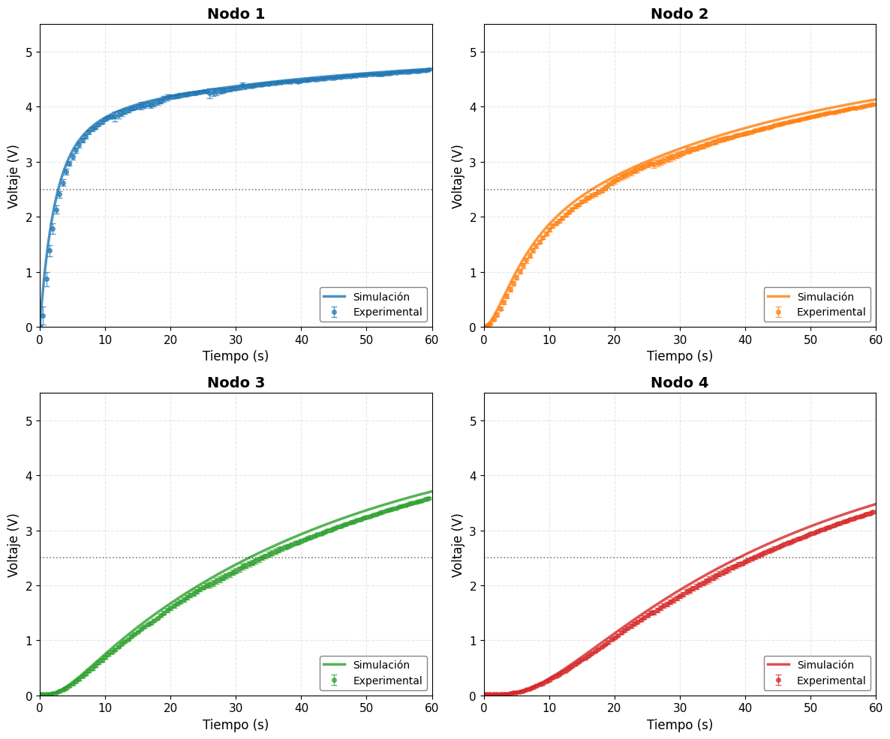

# Simulación Analógica de la Ecuación de Difusión mediante Redes RC

## Un Enfoque Experimental para la Enseñanza de la Física Computacional


---

## 📖 Resumen

La ecuación de difusión es fundamental en múltiples áreas de la física e ingeniería. En este trabajo presentamos el desarrollo teórico y la validación experimental de un computador analógico basado en una red de resistencias y capacitores (RC) que implementa físicamente una dinámica equivalente a una discretización espacial de la ecuación de difusión.

Se establece la analogía formal entre el sistema térmico y el circuito eléctrico. Para la topología real del prototipo (resistencia de fuente $R_s = 32.7\text{k}\Omega$ y resistencia efectiva entre nodos $R_d = 65.4\text{k}\Omega\$, la equivalencia fundamental es $\alpha = h^2/(R_d C)$.

Se implementó un prototipo de 4 nodos (configuración 1×4) y se diseñó un sistema de adquisición de datos de bajo costo utilizando un Arduino Uno. Se realizaron 5 repeticiones experimentales, obteniendo tiempos de subida al 50% de $t_{50,1} = 2.95 \pm 0.23\text{s}$, $t_{50,2} = 7.95 \pm 0.97 \text{s}$, $t_{50,3} = 29.45 \pm 0.13 \text{s}$ y $t_{50,4} = 36.50 \pm 0.13\text{s}$. La simulación calibrada reproduce la dinámica con un error normalizado inferior al 4%.

Este enfoque demuestra el potencial de las herramientas de hardware abierto para la instrumentación científica en la enseñanza de la física.

---

## 📂 Contenido del repositorio

| Archivo | Descripción |
|---------|-------------|
| `simulacion_rc_1x4_calibrada.py` | Script de simulación calibrada con valores reales (RK4) |
| `simulacion_rc_1x4_optima.py` | Script de simulación a condiciones óptimas (nominales) |
| `adquisicion_python.py` | Script Python para adquisición de datos con Arduino (5 repeticiones) |
| `adquisicion_arduino.ino` | Código para Arduino Uno (control toggle) |
| `datos_rc_20260822_1308_medicion_1.xlsx` | Datos experimentales crudos (5 mediciones) |
| `datos_rc_20260822_1308_medicion_2.xlsx` |
| `datos_rc_20260822_1308_medicion_3.xlsx` |
| `datos_rc_20260822_1308_medicion_4.xlsx` |
| `datos_rc_20260822_1308_medicion_5.xlsx` |
| `datos_rc_20260822_1308_promedio.xlsx` |Datos experimentales promediados (media y desviación estándar) |
| `comparacion_topologia_real.png` | Figura comparativa: simulación calibrada vs experimento |
| `simulacion_red_1x4_neumann.png` | Simulación a condiciones óptimas |
| `simulacion_red_1x4_real.png` | Simulación calibrada con valores reales |
| `README.md` | Este archivo |

---

## ⚙️ Parámetros de la simulación y el experimento

### Condiciones óptimas (nominales)

| Parámetro | Símbolo | Valor |
|:----------|:--------|:------|
| Resistencia de fuente | $R_s$ | $33.0 \text{k}\Omega$ |
| Resistencia entre nodos | $R_d = 2R_s$ | $66.0 \text{k}\Omega$|
| Capacitancia | $C$ | $100.0 \mu\text{F}$ |
| Voltaje de fuente | $V_{\text{fr}}$ | $5.00\text{V}$ |
| Constante de fuente | $\tau_s = R_s C$ | $3.30\text{s}$ |
| Constante de difusión | $\tau_d = R_d C$ | $6.60\text{s}$ |
| Difusividad equivalente | $\alpha = h^2/(R_d C)$ | $1.515 \times 10^{-5}\text{m}^2/\text{s}$ |

### Condiciones reales (medidas con multímetro)

| Parámetro | Símbolo | Valor Medido |
|:----------|:--------|:------------|
| Resistencia de fuente | $R_s$ | **32.7 kΩ** |
| Resistencia entre nodos | $R_d = 2R_s$ | **65.4 kΩ** |
| Capacitancia | $C$ | **98.2 µF** |
| Voltaje de fuente | $V_{\text{fr}}$ | **4.99 V** |
| Constante de fuente | $\tau_s = R_s C$ | **3.211 s** |
| Constante de difusión | $\tau_d = R_d C$ | **6.422 s** |
| Difusividad equivalente | $\alpha = h^2/(R_d C)$ | **1.557 × 10⁻⁵ m²/s** |

**Condiciones de frontera implementadas:**
- **Extremo izquierdo (Nodo 1):** Dirichlet (voltaje fijo $V_{\text{fr}}$)
- **Extremo derecho (Nodo 4):** Neumann (corriente nula, circuito abierto)

---

## 📊 Resultados principales

### Simulación calibrada vs experimento

| Nodo | $t_{50}$ Sim (s) | $t_{50}$ Exp (s) | $V$ a 60s Sim (V) | $V$ a 60s Exp (V) |
|:----:|:---:|:---:|:---:|:---:|
| 1 | 2.85 | $3.25 \pm 0.08$ | 4.689 | $4.671 \pm 0.010$ |
| 2 | 16.60 | $18.20 \pm 0.04$ | 4.133 | $4.056 \pm 0.019$ |
| 3 | 32.05 | $34.00 \pm 0.05$ | 3.708 | $3.594 \pm 0.024$ |
| 4 | 39.00 | $41.30 \pm 0.04$ | 3.478 | $3.347 \pm 0.027$ |

### Métricas de concordancia

| Nodo | RMSE (V) | NRMSE (%) |
|:----:|:---:|:---:|
| 1 | 0.083 | **1.66** |
| 2 | 0.094 | **1.87** |
| 3 | 0.100 | **2.00** |
| 4 | 0.102 | **2.04** |

**NRMSE** = (RMSE / 5V) × 100%

Todos los NRMSE son inferiores al 2.1%, lo que confirma cuantitativamente la validez del modelo.

### Verificación de la equivalencia fundamental

Con $h = 1.0\,\text{cm} = 0.010\,\text{m}$ y $\tau_d = R_d C = 6.422\,\text{s}$:

$$\alpha = \frac{(0.010\ \text{m})^{2}}{6.422\ \text{s}} = 1.557 \times 10^{-5}\ \text{m}^{2}/\text{s}$$

Este valor es consistente con la estimación nominal ($1.515 \times 10^{-5}\,\text{m}^2/\text{s}$), validando la analogía térmico-eléctrica dentro de las tolerancias experimentales.

### Comparación gráfica

La siguiente figura muestra la superposición de la simulación calibrada (líneas) y los datos experimentales (puntos con barras de error de ±1σ) para los nodos 1 a 4:



---

## 🔬 Adquisición de datos experimentales

Los datos experimentales fueron capturados utilizando un **Arduino Uno** como sistema de adquisición de bajo costo. Los voltajes en los nodos 1 a 4 de la red RC se conectaron directamente a las entradas analógicas **A0, A1, A2 y A3** del Arduino.

### Hardware utilizado
- Arduino Uno
- Red RC 1×4 con $R_s = 32.7 \text{k}\Omega$, $R_d = 65.4 \text{k}\Omega$, $C = 98.2\mu\text{F}$
- Fuente de alimentación de $4.99 \text{V}$ (desde el Arduino)
- Botón de control toggle para iniciar/detener la medición

### Protocolo experimental
- **Número de repeticiones:** 5
- **Duración por medición:** 60 s
- **Tiempo de descarga entre mediciones:** 120 s
- **Tasa de muestreo:** ~20 muestras/s (intervalo de ~52 ms)

### Código de adquisición

El código para el Arduino se encuentra en `adquisicion_arduino.ino`. Para usarlo:

1. Conecta los nodos de la red RC a los pines A0-A3 del Arduino.
2. Carga el código en el Arduino.
3. Ejecuta el script de Python `adquisicion_python.py` para leer los datos y guardarlos en un archivo Excel.

### Archivo de datos

Los datos capturados se encuentran en `datos_RC_individual.xlsx` (5 hojas, una por repetición) y en `datos_rc_promedio.xlsx` (promedio y desviación estándar). Las columnas son:

| Columna | Descripción |
|---------|-------------|
| Tiempo (s) | Tiempo en segundos |
| Canal_1_mean (V) | Voltaje medio en el Nodo 1 |
| Canal_1_std (V) | Desviación estándar en el Nodo 1 |
| Canal_2_mean (V) | Voltaje medio en el Nodo 2 |
| Canal_2_std (V) | Desviación estándar en el Nodo 2 |
| Canal_3_mean (V) | Voltaje medio en el Nodo 3 |
| Canal_3_std (V) | Desviación estándar en el Nodo 3 |
| Canal_4_mean (V) | Voltaje medio en el Nodo 4 |
| Canal_4_std (V) | Desviación estándar en el Nodo 4 |

---

## 🛠️ Requisitos

- Python 3.10+
- NumPy
- Matplotlib
- Pandas
- openpyxl (para leer archivos .xlsx)
- pyserial (para comunicación con Arduino)
- SciPy (para métricas RMSE y NRMSE)

## 🚀 Cómo ejecutar

### En local (con Python)

```bash
# Clonar el repositorio
git clone https://github.com/TheMelladator/simulacion-red-rc.git
cd simulacion-red-rc

# Instalar dependencias
pip install numpy matplotlib pandas openpyxl pyserial scipy

# Ejecutar la simulación calibrada
python simulacion_rc_1x4_calibrada.py

# Ejecutar la simulación óptima
python simulacion_rc_1x4_optima.py
```

### Adquisición de datos con Arduino

1. Conectar la red RC al Arduino:
   - Nodo 1 → A0
   - Nodo 2 → A1
   - Nodo 3 → A2
   - Nodo 4 → A3
   - Tierra del circuito → GND del Arduino

2. Cargar el código en el Arduino:
   - Abrir `arduino_adquisicion/adquisicion_arduino.ino` en el IDE de Arduino
   - Seleccionar la placa "Arduino Uno" y el puerto correcto
   - Subir el código

3. Configurar el puerto en el script de Python:
   - Cambiar la variable `PUERTO` en `adquisicion_python.py`
   - Windows: `'COM3'`, `'COM4'`, etc.
   - Linux/Mac: `'/dev/ttyUSB0'`, `'/dev/ttyACM0'`, etc.

4. Ejecutar el script de Python:
   ```bash
   cd arduino_adquisicion
   python adquisicion_python.py
   ```

5. Los datos se guardarán automáticamente en un archivo CSV con formato `datos_experimentales_YYYYMMDD_HHMMSS.csv`.

---

## Autor

**Fernando Mellado C.**  
Escuela Superior de Física y Matemáticas  
Instituto Politécnico Nacional  
Av. Instituto Politécnico Nacional S/N, Edif. 9, Col. Nueva Industrial Vallejo, Gustavo A. Madero, C.P. 07700, Ciudad de México.  
Correo: lmelladoc1400@alumno.ipn.mx

## Cómo citar

Si utilizas este código o estos datos, por favor cita:

> Mellado C., F. *Simulación Analógica de la Ecuación de Difusión mediante Redes RC: Un Enfoque Experimental para la Enseñanza de la Física Computacional*. Escuela Superior de Física y Matemáticas, Instituto Politécnico Nacional, Ciudad de México.

---

## Referencias

[1] V. Bush, "The Differential Analyzer: A New Machine for Solving Differential Equations," Journal of the Franklin Institute, vol. 212, no. 4, pp. 447–488, 1931, doi: 10.1016/S0016-0032(31)90616-9.

[2] H. S. Carslaw and J. C. Jaeger, Conduction of Heat in Solids, 2nd ed. Oxford: Clarendon Press, 1959.

[3] J. Crank, The Mathematics of Diffusion, 2nd ed. Oxford: Clarendon Press, 1975.

[4] J.-B.-J. Fourier, Théorie analytique de la chaleur. Paris: Chez Firmin Didot, père et fils, 1822.

[5] G. A. Korn and T. M. Korn, Electronic Analog Computers (d-c Analog Computers), 2nd ed. New York: McGraw-Hill, 1956.

[6] J. D. Murray, Mathematical Biology: I. An Introduction, 3rd ed. New York: Springer, 2002, doi: 10.1007/B98868.

[7] G. S. Ohm, Die galvanische Kette, mathematisch bearbeitet. Berlin: T. H. Riemann, 1827.

[8] A. Okubo, Diffusion and Ecological Problems: Mathematical Models. Berlin: Springer-Verlag, 1980.

[9] A. D. Polyanin, Handbook of Linear Partial Differential Equations for Engineers and Scientists. Boca Raton, FL: Chapman & Hall/CRC, 2002, doi: 10.1201/9781420035322.

[10] D. Sierociuk, T. Skovranek, M. Macias, I. Podlubny, I. Petras, A. Dzielinski, and P. Ziubinski, "Diffusion process modeling by using fractional-order models," Applied Mathematics and Computation, vol. 257, pp. 2–11, 2015, doi: 10.1016/j.amc.2014.11.028.

[11] C. Giles and B. Ulmann, "Solving the two-dimensional heat-equation," Analog Computer Applications, Application Note #24, 2020.

[12] Microchip Technology Inc., "ATmega328P 8-bit AVR Microcontroller with 32K Bytes In-System Programmable Flash," Datasheet DS40002061A, 2016.
---

## Licencia

Este proyecto se distribuye con fines académicos y educativos. Para uso comercial, contactar al autor.
