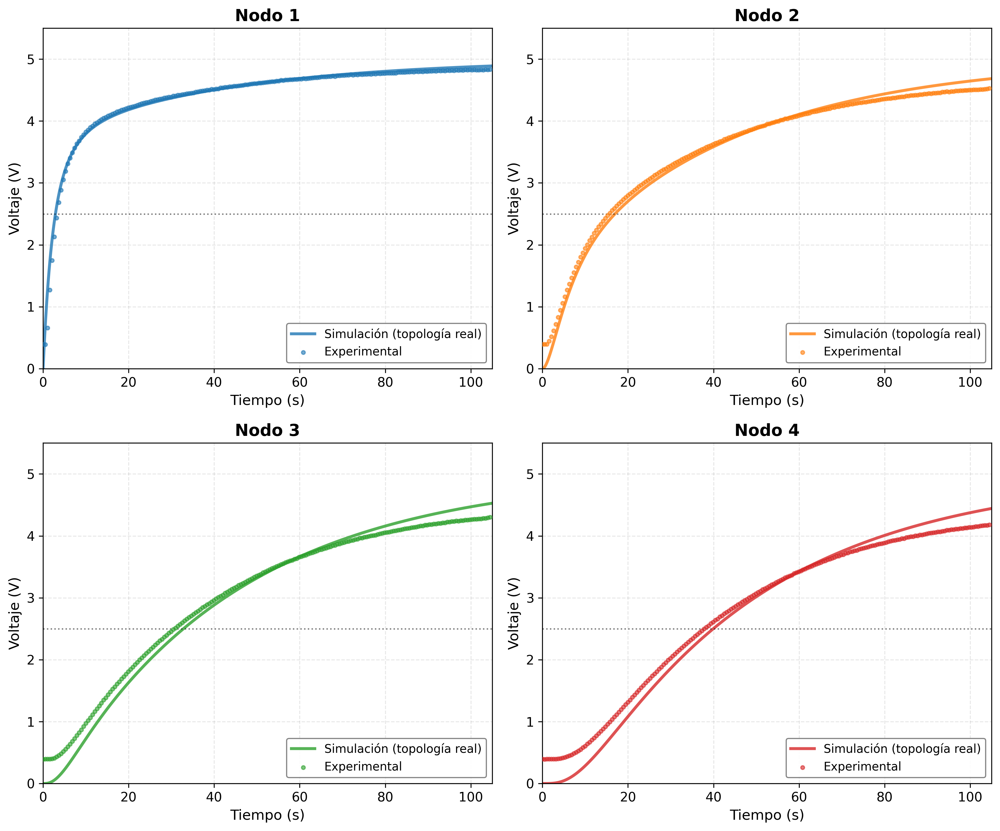

# Simulación Analógica de la Ecuación de Difusión mediante Redes RC

## Un Enfoque Experimental para la Enseñanza de la Física Computacional


---

## 📖 Resumen

La ecuación de difusión es fundamental en múltiples áreas de la física e ingeniería. En este trabajo presentamos el desarrollo teórico y la validación experimental de un computador analógico basado en una red de resistencias y capacitores (RC) que implementa físicamente una dinámica equivalente a una discretización espacial de la ecuación de difusión.

Se establece la analogía formal entre el sistema térmico y el circuito eléctrico. Para la topología real del prototipo resistencia de fuente $R_s = 33\,\text{k}\Omega$ y resistencia efectiva entre nodos $R_d = 2R_s = 66\,\text{k}\Omega$, la equivalencia fundamental es:

$$\alpha = \frac{h^{2}}{R_d C} = \frac{h^{2}}{2R_s C}$$

Se implementó un prototipo de 4 nodos (configuración 1×4) y se diseñó un sistema de adquisición de datos de bajo costo utilizando un **Arduino Uno** como sistema de adquisición multicanal.

Se realizaron dos conjuntos de experimentos:

1. **Sin carga de visualización:** Validación cuantitativa del modelo lineal.
2. **Con carga de visualización:** Estudio del efecto de la instrumentación (transistor BC547 y LED).

**Palabras clave:** computación analógica, ecuación de difusión, redes RC, analogía térmico-eléctrica, Arduino, enseñanza de la física

---

## Contenido del repositorio

| Archivo | Descripción |
|---------|-------------|
| `simulacion_rc.py` | Script principal de la simulación numérica (RK4) con topología real |
| `datos_RC_individual.xlsx` | Datos experimentales (mediciones reales) |
| `comparacion_subplots_topologia_real.png` | Figura comparativa: simulación vs. experimento sin carga |
| `arduino_adquisicion/adquisicion_arduino.ino` | Código para Arduino Uno (control toggle) |
| `arduino_adquisicion/adquisicion_python.py` | Script Python para adquirir y procesar datos |
| `README.md` | Este archivo |

---

## Marco teórico: la analogía térmico-eléctrica

La conducción de calor en un medio isotrópico está gobernada por la ecuación de calor:

$$\frac{\partial T(x,t)}{\partial t} = \alpha \frac{\partial^{2}T(x,t)}{\partial x^{2}}$$

donde \(T(x,t)\) es la temperatura y \(\alpha = k/(\rho c_p)\) es la difusividad térmica.

Aplicando la ley de corrientes de Kirchhoff (LCK) a la red RC 1×4 con topología real:

- **Nodo 1:** \( \displaystyle C \frac{dV_1}{dt} = \frac{V_{\text{fr}} - V_1}{R_s} + \frac{V_2 - V_1}{R_d} \)
- **Nodos interiores:** \( \displaystyle C \frac{dV_i}{dt} = \frac{V_{i-1} - V_i}{R_d} + \frac{V_{i+1} - V_i}{R_d}, \quad i = 2,3 \)
- **Nodo 4 (Neumann):** \( \displaystyle C \frac{dV_4}{dt} = \frac{V_3 - V_4}{R_d} \)

donde \(R_s = 33\,\text{k}\Omega\) y \(R_d = 2R_s = 66\,\text{k}\Omega\).

Comparando con la discretización por diferencias finitas de la ecuación de calor, se establece la equivalencia fundamental:

$$\boxed{\alpha = \frac{h^{2}}{R_d C} = \frac{h^{2}}{2R_s C}}$$

---

## Parámetros de la simulación y el experimento

| Parámetro | Símbolo | Valor |
|:----------|:--------|:------|
| Resistencia de fuente | \(R_s\) | \(33\,\text{k}\Omega\) |
| Resistencia entre nodos | \(R_d = 2R_s\) | \(66\,\text{k}\Omega\) |
| Capacitancia a tierra | \(C\) | \(100\,\mu\text{F}\) |
| Constante de tiempo de fuente | \(\tau_s = R_s C\) | \(3.30\,\text{s}\) |
| Constante de tiempo de difusión | \(\tau_d = R_d C\) | \(6.60\,\text{s}\) |
| Voltaje de excitación | \(V_0\) | \(5.0\,\text{V}\) |
| Paso de integración | \(\Delta t\) | \(0.05\,\text{s}\) |
| Tiempo total de simulación | \(t_{\text{final}}\) | \(120.0\,\text{s}\) |
| Número de nodos | \(N\) | 4 |
| Espaciado de malla | \(h\) | \(1.0\,\text{cm}\) |
| Difusividad equivalente | \(\alpha = h^2/(R_d C)\) | \(1.515 \times 10^{-5}\,\text{m}^2/\text{s}\) |

**Condiciones de frontera implementadas:**
- **Extremo izquierdo (Nodo 1):** Dirichlet (voltaje fijo \(V_0 = 5.0\,\text{V}\))
- **Extremo derecho (Nodo 4):** Neumann (corriente nula, circuito abierto — equivalente a aislamiento térmico)

---

## Adquisición de datos experimentales

Los datos experimentales fueron capturados utilizando un **Arduino Uno** como sistema de adquisición de bajo costo. Los voltajes en los nodos 1 a 4 de la red RC se conectaron directamente a las entradas analógicas **A0, A1, A2 y A3** del Arduino.

### Hardware utilizado
- Arduino Uno
- Red RC 1×4 con \(R_s = 33\,\text{k}\Omega\), \(R_d = 66\,\text{k}\Omega\), \(C = 100\,\mu\text{F}\)
- Fuente de alimentación de \(5\,\text{V}\)
- Botón de control toggle para iniciar/detener la medición

### Configuraciones experimentales
1. **Sin carga de visualización:** Validación del modelo lineal.
2. **Con carga de visualización:** Estudio del efecto del transistor BC547 y LED.

### Código de adquisición

El código para el Arduino se encuentra en `arduino_adquisicion/adquisicion_arduino.ino`. Para usarlo:

1. Conecta los nodos de la red RC a los pines A0-A3 del Arduino.
2. Carga el código en el Arduino.
3. Ejecuta el script de Python `arduino_adquisicion/adquisicion_python.py` para leer los datos y guardarlos en un archivo CSV.

### Archivo de datos

Los datos capturados se encuentran en el archivo `datos_RC_individual.xlsx` (formato Excel). Las columnas del archivo son:

| Columna | Descripción |
|---------|-------------|
| Tiempo (ms) | Tiempo en milisegundos |
| Canal_1 (V) | Voltaje en el Nodo 1 |
| Canal_2 (V) | Voltaje en el Nodo 2 |
| Canal_3 (V) | Voltaje en el Nodo 3 |
| Canal_4 (V) | Voltaje en el Nodo 4 |

---

## Resultados principales

### Simulación con topología real (1×4)

La simulación utiliza el modelo corregido con \(R_s = 33\,\text{k}\Omega\) y \(R_d = 66\,\text{k}\Omega\).

| Nodo | \(t_{50}\) (simulado, s) | Voltaje final (V) |
|:----:|:---:|:---:|
| 1 | 2.89 | 4.93 |
| 2 | 16.96 | 4.87 |
| 3 | 32.82 | 4.80 |
| 4 | 39.94 | 4.73 |

### Resultados experimentales (sin carga)

| Nodo | Voltaje a 104.6 s (V) | \(t_{50}\) (s) |
|:----:|:---:|:---:|
| 1 | 4.839 | 2.3 |
| 2 | 4.521 | 8.5 |
| 3 | 4.301 | 15.5 |
| 4 | 4.179 | 20.5 |

### Métricas de concordancia (sin carga)

| Nodo | RMSE (V) | NRMSE (%) |
|:----:|:---:|:---:|
| 1 | 0.075 | 1.49 |
| 2 | 0.098 | 1.96 |
| 3 | 0.160 | 3.21 |
| 4 | 0.192 | 3.84 |

**NRMSE** = (RMSE / 5V) × 100%

### Verificación de la equivalencia fundamental

Con \(h = 1.0\,\text{cm} = 0.010\,\text{m}\) y \(\tau_d = R_d C = 6.60\,\text{s}\):

$$\alpha = \frac{(0.010\ \text{m})^{2}}{6.60\ \text{s}} = 1.515 \times 10^{-5}\ \text{m}^{2}/\text{s}$$

### Comparación gráfica

La siguiente figura muestra la superposición de la simulación (líneas) y los datos experimentales (puntos) para los nodos 1 a 4 en subplots individuales:



---

##  Requisitos

- Python 3.10+
- NumPy
- Matplotlib
- Pandas
- openpyxl (para leer archivos .xlsx)
- pyserial (para comunicación con Arduino)
- SciPy (para interpolación y métricas)

##  Cómo ejecutar

### En local (con Python)

```bash
# Clonar el repositorio
git clone https://github.com/TheMelladator/simulacion-red-rc-1x5.git
cd simulacion-red-rc-1x5

# Instalar dependencias
pip install numpy matplotlib pandas openpyxl pyserial scipy

# Ejecutar la simulación
python simulacion_rc_1x4.py

### Adquisición de datos con Arduino

1. Conectar la red RC al Arduino:
   - Nodo 1 → A0
   - Nodo 2 → A1
   - Nodo 3 → A2
   - Nodo 4 → A3
   - Tierra del circuito → GND del Arduino

2. Cargar el código en el Arduino:
   - Abrir `arduino_adquisicion/adquisicion_arduino.ino` en el IDE de Arduino
   - Seleccionar la placa "Arduino Uno" y el puerto correcto
   - Subir el código

3. Configurar el puerto en el script de Python:
   - Cambiar la variable `PUERTO` en `adquisicion_python.py`
   - Windows: `'COM3'`, `'COM4'`, etc.
   - Linux/Mac: `'/dev/ttyUSB0'`, `'/dev/ttyACM0'`, etc.

4. Ejecutar el script de Python:
   ```bash
   cd arduino_adquisicion
   python adquisicion_python.py
   ```

5. Los datos se guardarán automáticamente en un archivo CSV con formato `datos_experimentales_YYYYMMDD_HHMMSS.csv`.

---

## Autor

**Fernando Mellado C.**  
Escuela Superior de Física y Matemáticas  
Instituto Politécnico Nacional  
Av. Instituto Politécnico Nacional S/N, Edif. 9, Col. Nueva Industrial Vallejo, Gustavo A. Madero, C.P. 07700, Ciudad de México.  
Correo: luisfernandomelladocanas@outlook.com

## Cómo citar

Si utilizas este código o estos datos, por favor cita:

> Mellado C., F. *Simulación Analógica de la Ecuación de Difusión mediante Redes RC: Un Enfoque Experimental para la Enseñanza de la Física Computacional*. Escuela Superior de Física y Matemáticas, Instituto Politécnico Nacional, Ciudad de México.

---

## Referencias

[1] V. Bush, "The Differential Analyzer: A New Machine for Solving Differential Equations," Journal of the Franklin Institute, vol. 212, no. 4, pp. 447–488, 1931, doi: 10.1016/S0016-0032(31)90616-9.

[2] H. S. Carslaw and J. C. Jaeger, Conduction of Heat in Solids, 2nd ed. Oxford: Clarendon Press, 1959.

[3] J. Crank, The Mathematics of Diffusion, 2nd ed. Oxford: Clarendon Press, 1975.

[4] J.-B.-J. Fourier, Théorie analytique de la chaleur. Paris: Chez Firmin Didot, père et fils, 1822.

[5] G. A. Korn and T. M. Korn, Electronic Analog Computers (d-c Analog Computers), 2nd ed. New York: McGraw-Hill, 1956.

[6] J. D. Murray, Mathematical Biology: I. An Introduction, 3rd ed. New York: Springer, 2002, doi: 10.1007/B98868.

[7] G. S. Ohm, Die galvanische Kette, mathematisch bearbeitet. Berlin: T. H. Riemann, 1827.

[8] A. Okubo, Diffusion and Ecological Problems: Mathematical Models. Berlin: Springer-Verlag, 1980.

[9] A. D. Polyanin, Handbook of Linear Partial Differential Equations for Engineers and Scientists. Boca Raton, FL: Chapman & Hall/CRC, 2002, doi: 10.1201/9781420035322.

[10] D. Sierociuk, T. Skovranek, M. Macias, I. Podlubny, I. Petras, A. Dzielinski, and P. Ziubinski, "Diffusion process modeling by using fractional-order models," Applied Mathematics and Computation, vol. 257, pp. 2–11, 2015, doi: 10.1016/j.amc.2014.11.028.

[11] C. Giles and B. Ulmann, "Solving the two-dimensional heat-equation," Analog Computer Applications, Application Note #24, 2020.

---

## Licencia

Este proyecto se distribuye con fines académicos y educativos. Para uso comercial, contactar al autor.
