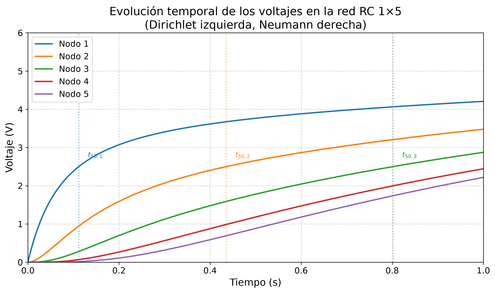

# Simulacion Analogica de la Ecuacion de Difusion mediante Redes RC: Un Enfoque Experimental para la Ensenanza de la Fisica Computacional

## Descripcion

La ecuacion de difusion es fundamental en multiples areas de la fisica e ingenieria. Este repositorio contiene el codigo, los datos y las figuras de una simulacion computacional que modela el proceso de difusion unidimensional mediante una red de resistencias y capacitores (RC) de 1x5 nodos. El trabajo se fundamenta en la analogia matematica entre la ecuacion de difusion de Fourier y la ecuacion de nodo de Kirchhoff en una red RC.

Se implementa una simulacion numerica del sistema de ecuaciones diferenciales acopladas utilizando el metodo de Runge-Kutta de cuarto orden (RK4). Los resultados muestran el comportamiento caracteristico de la difusion: la propagacion de una perturbacion desde el nodo excitado hacia los nodos vecinos con una escala temporal caracteristica determinada por la constante de tiempo tau = R C.

Este enfoque ofrece una herramienta pedagogica poderosa para la visualizacion de fenomenos de difusion, conectando la fisica termica, la teoria de circuitos y la matematica aplicada.

---

## Contenido del repositorio

| Archivo | Descripcion |
|---------|-------------|
| simulacion_red_rc.py | Script principal de la simulacion numerica (RK4) |
| simulacion_red_1x5_neumann.csv | Datos de salida: evolucion temporal del voltaje en cada nodo |
| figura_tiempos_subida.png | Grafica de los tiempos de subida al 50 por ciento por nodo |
| README.md | Este archivo |

---

## Parametros de la simulacion

| Parametro | Simbolo | Valor | Descripcion |
|-----------|---------|-------|-------------|
| Resistencia | R | 10.0 kOhm | Resistencia entre nodos consecutivos |
| Capacitancia | C | 10.0 uF | Capacitancia a tierra de cada nodo |
| Constante de tiempo | tau = R C | 0.100 s | Tiempo caracteristico del circuito |
| Espaciado de malla | h | 1.0 cm = 0.010 m | Distancia entre nodos |
| Difusividad equivalente | alpha = h^2 / tau | 1.00 x 10^-3 m^2/s | Difusividad termica equivalente |
| Voltaje de frontera | V_0 | 5.0 V | Condicion de Dirichlet (izquierda) |
| Paso de integracion | Delta t | 10^-4 s | Paso del metodo RK4 |
| Tiempo total | t_final | 1.0 s | Duracion de la simulacion |
| Numero de nodos | N | 5 | Nodos de la red RC |

---

## Resultados principales

### Tiempos de subida al 50% (t_50)

| Nodo | t_50 [s] | Observacion |
|------|----------|-------------|
| 1 | 0.1118 | Aproximadamente 1.1 tau |
| 2 | 0.4355 | Aproximadamente 4.4 tau |
| 3 | 0.8018 | Aproximadamente 8.0 tau |
| 4 | -- | No alcanzo el 50% en el tiempo de simulacion |
| 5 | -- | No alcanzo el 50% en el tiempo de simulacion |

La figura siguiente resume los tiempos de subida respecto al tiempo caracteristico tau = R C:

### Verificacion de la equivalencia fundamental

La difusividad termica equivalente obtenida a partir de los parametros electricos es:

    alpha = h^2 / (R C) = (0.010 m)^2 / 0.100 s = 1.00 x 10^-3 m^2/s

Esta relacion permite establecer la correspondencia directa entre el problema electrico y el problema termico de conduccion de calor en solidos, segun la equivalencia fundamental derivada en el articulo:

    alpha = h^2 / (R C)

---

## Requisitos

- Python 3.10 o superior
- NumPy
- Matplotlib
- Pandas (opcional, para manipulacion de CSV)

---

## Como ejecutar

1. Clona el repositorio:

    "git clone https://github.com/TheMelladator/simulacion-red-rc-1x5.git"
    "cd simulacion-red-rc-1x5"

2. Ejecuta el script principal:

    "python simulacion_red_rc.py"

3. Los resultados se guardan automaticamente en:
   - "simulacion_red_1x5_neumann.csv" (datos numericos)
   - "figura_tiempos_subida.png" (visualizacion, si el script la genera)

---

## Autor

**Fernando Mellado C.**
Escuela Superior de Fisica y Matematicas
Instituto Politecnico Nacional
Av. Instituto Politecnico Nacional S/N, Edif. 9, Col. Nueva Industrial Vallejo
Gustavo A. Madero, C.P. 07700, Ciudad de Mexico
Correo: lmelladoc1400@alumno.ipn.mx

---

## Licencia

Este proyecto esta licenciado bajo la Licencia MIT.

Copyright (c) 2025 Fernando Mellado C.

Se concede permiso, libre de cargos, a cualquier persona que obtenga una copia de este software y de los archivos de documentacion asociados (el "Software"), para utilizar el Software sin restriccion, incluyendo sin limitacion los derechos de usar, copiar, modificar, fusionar, publicar, distribuir, sublicenciar y/o vender copias del Software, y para permitir a las personas a las que se les proporcione el Software a hacer lo mismo, sujeto a las siguientes condiciones:

El aviso de copyright anterior y este aviso de permiso se incluiran en todas las copias o partes sustanciales del Software.

EL SOFTWARE SE PROPORCIONA "TAL CUAL", SIN GARANTIA DE NINGUN TIPO, EXPRESA O IMPLICITA, INCLUYENDO PERO NO LIMITADO A GARANTIAS DE COMERCIALIZACION, IDONEIDAD PARA UN PROPOSITO PARTICULAR Y NO INFRACCION. EN NINGUN CASO LOS AUTORES O TITULARES DEL COPYRIGHT SERA RESPONSABLES DE NINGUNA RECLAMACION, DANOS U OTRA RESPONSABILIDAD, YA SEA EN UNA ACCION CONTRACTUAL, AGRAVIO O DE OTRO MODO, DERIVADA DE, FUERA DE O EN CONEXION CON EL SOFTWARE O SU USO U OTROS TRATOS EN EL SOFTWARE.

## Como citar

Si utilizas este codigo o estos datos, por favor cita:

&gt; Mellado C., F. Simulacion Analogica de la Ecuacion de Difusion mediante Redes RC: Un Enfoque Experimental para la Ensenanza de la Fisica Computacional. Escuela Superior de Fisica y Matematicas, Instituto Politecnico Nacional.

---

## Referencias

[1] V. Bush, "The Differential Analyzer: A New Machine for Solving Differential Equations," Journal of the Franklin Institute, vol. 212, no. 4, pp. 447-488, 1931, doi: 10.1016/S0016-0032(31)90616-9.

[2] H. S. Carslaw and J. C. Jaeger, Conduction of Heat in Solids, 2nd ed. Oxford: Clarendon Press, 1959.

[3] J. Crank, The Mathematics of Diffusion, 2nd ed. Oxford: Clarendon Press, 1975.

[4] J.-B.-J. Fourier, Theorie analytique de la chaleur. Paris: Chez Firmin Didot, pere et fils, 1822.

[5] G. A. Korn and T. M. Korn, Electronic Analog Computers (d-c Analog Computers), 2nd ed. New York: McGraw-Hill, 1956.

[6] J. D. Murray, Mathematical Biology: I. An Introduction, 3rd ed. New York: Springer, 2002, doi: 10.1007/B98868.

[7] G. S. Ohm, Die galvanische Kette, mathematisch bearbeitet. Berlin: T. H. Riemann, 1827.

[8] A. Okubo, Diffusion and Ecological Problems: Mathematical Models. Berlin: Springer-Verlag, 1980.

[9] A. D. Polyanin, Handbook of Linear Partial Differential Equations for Engineers and Scientists. Boca Raton, FL: Chapman & Hall/CRC, 2002, doi: 10.1201/9781420035322.

[10] W. H. Press, S. A. Teukolsky, W. T. Vetterling, and B. P. Flannery, Numerical Recipes: The Art of Scientific Computing, 3rd ed. Cambridge: Cambridge University Press, 2007.

[11] D. Sierociuk, T. Skovranek, M. Macias, I. Podlubny, I. Petras, A. Dzielinski, and P. Ziubinski, "Diffusion process modeling by using fractional-order models," Applied Mathematics and Computation, vol. 257, pp. 2-11, 2015, doi: 10.1016/j.amc.2014.11.028.

[12] C. Giles and B. Ulmann, "Solving the two-dimensional heat-equation," Analog Computer Applications, Application Note no. 24, 2020.

[13] B. Ulmann, Analog and Hybrid Computer Programming. Berlin, Boston: De Gruyter Oldenbourg, 2020, doi: 10.1515/9783110662207.

[14] Y. Takahashi, R. Ishikawa, and K. Honjo, "Accurate Distortion Prediction for Thermal Memory Effect in Power Amplifier Using Multi-Stage Thermal RC-Ladder Network," IEICE Transactions on Electronics, vol. E90-C, no. 9, pp. 1658-1663, 2007, doi: 10.1093/ietele/e90-c.9.1658.